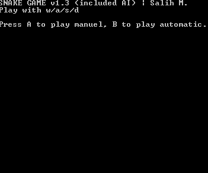

# Draw on Console (C, C++, Pascal)

   * [Draw on Console (C, C  , Pascal)](#draw-on-console-c-c-pascal)
      * [Introduction](#introduction)
      * [Animations](#animations)
      * [References](#references)

## Introduction

It all started with coding colorful and with animations 2048 game on console in Pascal. These codes have written by me while I was studying Computer Engineering B.S. Most of them belong to second year of my University life.  There are two most important things used in my codes:

- **First**; I have used the projection calculation based on the image below, so there are no 3rd party libraries. 

- **Second**; refreshing whole console was too computationally expensive, so I have optimized the refresh method to print only the renewed characters.

Used IDE's

- `C/C++` -> Orwell Dev-C++ 5.11
- `Pascal`-> Bloodshed Dev-Pascal 1.9.2
- `Java`-> Eclipse 4.12.0

## Animations

- [**`c_animation_3d_moving_cubes`**](c_animation_3d_moving_cubes)

- [**`c_animation_3d_wave`**](c_animation_3d_wave)

- [**`c_animation_circle`**](c_animation_circle)

- [**`c_animation_heart`**](c_animation_heart)

- [**`c_animation_math_functions`**](c_animation_math_functions)

- [**`c_animation_selection_sort`**](c_animation_selection_sort)

- [**`c_draw_sphere`**](c_draw_sphere)

- [**`c_game_candy_crush`**](c_game_candy_crush)

- [**`cpp_game_snake`**](cpp_game_snake)

- [**`pascal_game_2048`**](pascal_game_2048)

- (Extra: Not in console!) [**`java_animation_mandelbrot`**](java_animation_mandelbrot)

## References

- http://paulbourke.net/dataformats/asciiart/
- https://mashable.com/2012/02/09/google-valentine-surprise/